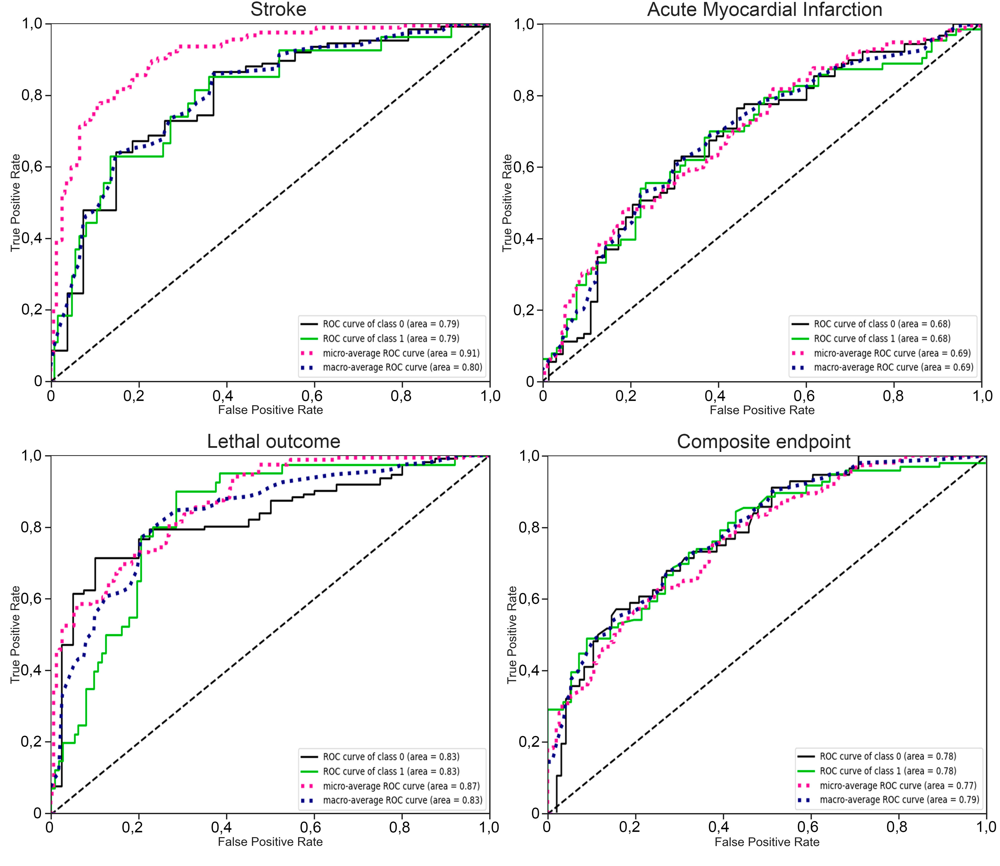

# 
 Machine learning algorithm to predict the long-term adverse cardiovascular events following coronary artery bypass surgery (CABG) 

## Project features:

* The dataset includes 152 cases of CABG,

* Adverse cardiovascular events have been predicted in the long-term follow-up period following CABG: stroke, myocardial infarction in combination with its subsequent revascularization, death and combined endpoint,

* Used ML models: logistic regression, decision trees, random forest method, super-random decision trees, gradient boosting, multilayer neural networks, K neighbor’s method and an ensemble of algorithms,

* Used optimizer: scikit-learn RandomizedSearchCV, and AutoML mljar-supervised.

## Results:

* The largest area under the ROC-curve was demonstrated by advanced variants of models based on a combination of decision trees that use gradient boosting, and especially the ensemble algorithm (the micro ROC AUC was 0.77-0.91 in 5-fold cross validation test),

*	The most important predictors are interventricular septal thickness, left ventricle ejection fraction, body mass index, and age.

  ML classification metrics
  

